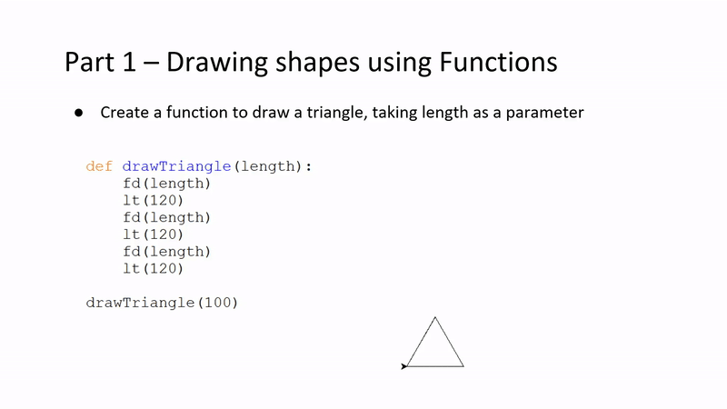
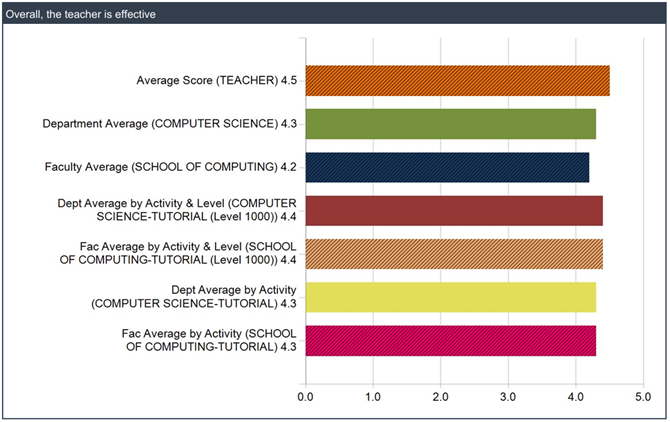
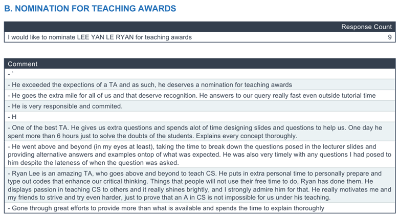

<!-- !PAGE CONTENT! -->

  <section id="digital_production_assistant" class="w3-container">
    <h2><b>Digital Production Assistant</b></h2>
    

      
      
      
    

    <h5 style="margin-bottom:20px">
      I collaborated with 3 professors and 2 other digital production assistants on producing engaging
      educational videos on Generative AI and Machine Learning. These videos are made for courses published
      under NUS Blended Learning 2.0, to be used by NUS professors and staff to gain relevant knowledge on 
      recent AI/ML advancements.
    </h5>
    <h5 style="margin-bottom:20px">
      The general workflow starts from understanding lecture slides made by the professors, converting them 
      into slides that are simple to understand, as well as integrating PowerPoint animations and transitions 
      to convey information better. Afterwards, we used Camtasia to mix the voice recordings and slides together,
      ensuring that volume levels stay consistent throughout the video. Lastly, we added captions using Descript,
      which are stored in .srt files so that the viewer can disable and enable captions whenever needed.
    </h5>
    <h5>
      Topics contributed:
      <ul style="margin-top:0;">
        <li>Prompt Engineering for Large Language Models</li>
        <li>Introduction to Generative AI</li>
        <li>k-Nearest Neighbors</li>
        <li>Decision Tree</li>
        <li>Convolutional Neural Networks</li>
        <li>Recurrent Neural Networks</li>
      </ul>
    </h5>
  </section>
  
  

  <section id="teaching_assistant" class="w3-container">
    <h2><b>Teaching Assistant</b></h2>
    

      
      
    

    <h5 style="margin-bottom:20px">
      I taught 25 NUS undergraduates CS1010E, a course on programming methodology in Python. The course
      educates students from the ground up, allowing those with no programming background to acquire computational
      skills at a moderate pace while having fun. 
    </h5>
    <h5>
      I incorporated animations and transitions learnt from my digital production assistant role into the PowerPoint
      slides. This allowed me to better visualise the flow of the code to bridge learning gaps. The animations also
      helped in keeping the students engaged in looking at the slides, as it would capture their attention.
    </h5>
    <!--   -->
    

      
      
      
      
    

    <h5>
    For their first lesson, I conducted the 'Spaghetti Tower' icebreaker challenge as a way to convey the analogy 
    that coding is an iterative process. The goal of the challenge was to make the tallest tower using spaghetti
    sticks and marshmallow. The students were split into 4 different groups, each building unique structures. The
    tallest tower was around 50cm.
    </h5>
     
    

      
      
    

    <h5 style="margin-bottom:20px">
    I received 9 nominations for teaching excellence, as well as better reviews on average compared to several
    departments, showing the efficiency of my teaching. The feedback report can be found 
    <a href="../../assets/pdf/cs1010e_feedback.pdf" target="_blank">here</a>.
    </h5>
    <h5>
    Topics taught:
    <ul style="margin-top:0;">
      <li>Variables</li>
      <li>Expressions</li>
      <li>Functions</li>
      <li>Iteration</li>
      <li>Recursion</li>
      <li>Sequences</li>
      <li>Higher Order Functions</li>
      <li>File I/O</li>
      <li>Multi-Dimensional Arrays</li>
      <li>Object-Oriented Programming</li>
      <li>Searching</li>
      <li>Sorting</li>
      <li>Time/Space Complexity</li>
      <li>Exceptions</li>
    </ul>
    </h5>
  </section>

  

